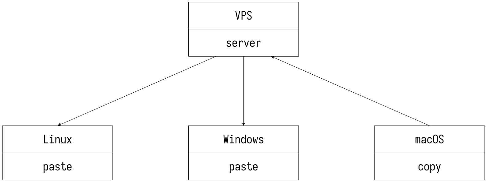

# KLIP

Copy/paste anything over the network.



Ever needed a clipboard that works over the network?

KLIP seamlessly transfers URLs, code snippets, documents, and virtually anything
else between arbitrary hosts.

No SSH needed, and hosts can sit behind NAT gateways, on different networks.

Fill in the clipboard ("copy") with whatever comes into the standard input:

```console
$ echo "clipboard content" | klc
```

Magically retrieve the content from any other host that has KLIP installed with
the same configuration:

```console
$ klp
clipboard content
```

Obviously, it can be used to transfer files as well:

```console
$ klc < kitty.gif
$ klp > kittycopy.gif
```

```console
$ tar cvf - *.txt | klc
$ klp | tar xvf -
```

In order to work around firewalls/NAT gateways, the clipboard content transmits
over TCP via a staging server.

Nothing transmits without end-to-end encryption; the server cannot learn much
about what the clipboard actually contains.

Data can be shared between different operating systems, including macOS and
Windows.

## Installation

### Precompiled binaries

~~Pre-compiled binaries for macOS, Linux, Windows, Dragonfly BSD (x86_64 only),
NetBSD (x86 and x86_64 only), and OpenBSD (x86 and x86_64 only) can be
downloaded here: https://git.5ht2.me/lmaotrigine/klip/releases/latest~~ For
legal reasons, spinning up containers for automated cross builds in CI is
currently not possible on this GitLab instance. The release process is manual,
and I will update this section when I actually upload the release archives.

### Compile the source code

This project is written in pure Rust, with some inline assembly for SIMD
accelerated cryptography and minimal FFI to interact with the operating system.

It is known to build on the latest stable compiler (at the time of writing, this
is 1.70). Enabling SIMD optimizations in the curve25519 implementation requires
a nightly compiler. Your mileage with SIMD may vary quite a bit. I have done
some extensive benchmarking, but if you find a corner case that hinders
performance, please let me know! Use either of the following incantations:

```console
$ cargo build --release
```

Only required if you are either developing, or you want AVX512 SIMD acceleration
for Curve25519 scalar multiplication.

```console
$ cargo +nightly build --release
```

The `klip` executable should then be available in the `target/release` directory.

## Setup

KLIP requires a bunch of keys. Generate them all with

```console
$ klip genkeys
```

This generates random keys (highly recommended).

You will need to copy parts (not all) of that command's output to a `.klip.toml`
configuration file.

A temporary alternative is to derive the keys from a password. The same password
will always generate the same set of keys, on all platforms. In order to do so,
add the `--password` switch:

```console
$ klip genkeys --password
```

The output of the `genkeys` command is all you need to build a configuration
file.

Only copy the section for servers on the staging server. Only copy the section
for clients on the clients.

Is a host going to act both as a staging server and as a client? Give it a think
before copying the "hybrid" section. Just in case, it's there.

The default location for the configuration file is `~/.klip.toml`. This can be
overridden using the `--config` option and providing the path to the
configuration file. This is useful for example if you don't want to use dot
files on Windows since they are not very common.

```console
PS> echo "GNU Terry Pratchett" | klc --config C:\Users\isis\klip.toml
```

Sample configuration file for a staging server:

```toml
listen     = "0.0.0.0:8075"     # edit appropriately
psk        = "0768e822c681c887e1c80ad57412aca814738bdd4380f00445d159d80d4c28c4"
sign_pk    = "6bdf6e6e0cfdcf6fd4991a9b27114a29fba538f91f84297892612a1b1767f58c"
```

Sample configuration file for clients:

```toml
connect    = "127.0.0.1:8075"   # edit appropriately
psk        = "0768e822c681c887e1c80ad57412aca814738bdd4380f00445d159d80d4c28c4"
sign_pk    = "6bdf6e6e0cfdcf6fd4991a9b27114a29fba538f91f84297892612a1b1767f58c"
sign_sk    = "3128a243ebf8f78dbf551741775f9da36d1ac0ffa11dc7776d038310ea762f2f"
encrypt_sk = "28956ee776dc1f171e652472c6a27ce27166bf58effa10b574dbe159128d8898"
```

Don't use these, obviously. Get your own keys as described [above](#setup). Edit
the `connect` and `listen` properties to reflect the staging server IP and port.
`chmod go-rwx ~/.klip.toml` might not be a bad idea.

## Usage (staging server)

Run the following command on the staging server (use `systemd`, `runit`,
`openrc`, heck even `docker` or `podman` or whatever to run it as a background
service):

```console
$ klip serve
```

The staging server has to be publicly accessible. At the very least it must be
reachable by the clients over TCP with the port you specify in the configuration.

Commands without a valid API key (present in the client configuration file) will
be rejected by the server.

## Usage (clients)

Copy standard input to the clipboard:

```console
$ klip copy
```

Retrieve the content of the clipboard and spit it to standard output:

```console
$ klip paste
```

Retrieve the content of the clipboard, clear the clipboard, and spit it to
standard output.

```console
$ klip move
```

Well, that's it!

Feed it anything. Text, binary data, whatever. If it fits it memory, it'll work.

## Suggested shell aliases

But wait, what about the `klc` and `klp` commands mentioned at the beginning?
Those are just shell aliases. Consult your shell's documentation to know more.
Some samples are given below:

```sh
# klo <content>: copy <content> to the clipboard
klo() {
  printf '%s' "$*" | klip copy
}

# klf <file>: copy the content of <file> to the clipboard
klf() {
  klip copy < $1
}

# klc: read the content to copy from STDIN
alias klc='klip copy'

# klp: paste the clipboard content
alias klp='klip paste'

# klm: move the clipboard content
alias klm='klip move'

# klz: delete the clipboard content
alias klz='klip copy < /dev/null'

# klfr [<dir>]: send a whole directory to the clipboard, as a tar archive
klfr() {
  tar cJpvf - ${1:-.} | klip copy
}

# klpr: extract clipboard content that was sent using the klfr command
alias klpr='klip paste | tar xJpvf -'
```

## KLIP integration in third-party applications

- The [KLIP extension for VSCode](https://git.5ht2.me/lmaotrigine/vscode-klip)
  is a first-party extension that allows copying and pasting text between hosts
  running the Visual Studio Code text editor.
- [`klip.vim`](https://git.5ht2.me/lmaotrigine/klip.vim) is a plugin for Vim/
  Neovim that allows copying and pasting text.

## Use cases

Use it to

* Securely send passwords, API keys, URLs from one host to another
* Share a clipboard with your teammates (which can be a lot of fun)
* Copy data from/to isolated VMs, without VMWare tools or shared volumes (great
  for unsupported operating systems and malware sandboxes)
* Copy files to and from a Windows machine, without Samba or SSH
* Transfer data between hosts sitting behind firewalls/NAT gateways
* Easily copy configuration files to multiple hosts
* Start a slow download at the office, retrieve it later at home
* Quickly back up a file to the cloud before messing with it
* ... and more!

## Protocol

Common definitions

```text
k: API key
ek: 256-bit symmetric encryption key
ekid: encryption key ID encoded as an unsigned 64-bit little-endian integer
m: plaintext
ct: XChaCha20 ek,n (m)
Hk,s: Blake2b(domain="KLIP", key=k, salt=s, size=32)
Len(x): x encoded as an unsigned 64-bit little-endian integer
n: random 192-bit nonce
r: random 256-bit client nonce
r': random 256-bit server nonce
ts: Unix timestamp as an unsigned 64-bit little-endian integer
Sid: Ed25519
v: 1
```

Copy:

```text
-> v || r || h0
h0 := Hk,0(v || r)

<- v || r' || h1
h1 := Hk,1(v || r' || h0)

-> 'S' || h2 || Len(ekid || n || ct) || ts || s || ekid || n || ct
s := Sig(ekid || n || ct)
h2 :=Hk,2(h1 || 'S' || ts || s)

<- Hk.3(h2)
```

Move/Paste:

```text
Move: opcode := 'M'
Paste: opcode := 'G'

-> v || r || h0
h0 := Hk,0(v || r)

<- v || r' || h1
h1 := Hk,1(v || r' || h0)

-> opcode || h2
h2 := Hk,2(h1 || opcode)

<- Hk,3(h2 || ts || s) || Len(ekid || n || ct) || ts || s || ekid || n || ct
s := Sig(ekid || n || ct)
```

## TODO

- [ ] remove dependency on clap due to frequent major version bumps
